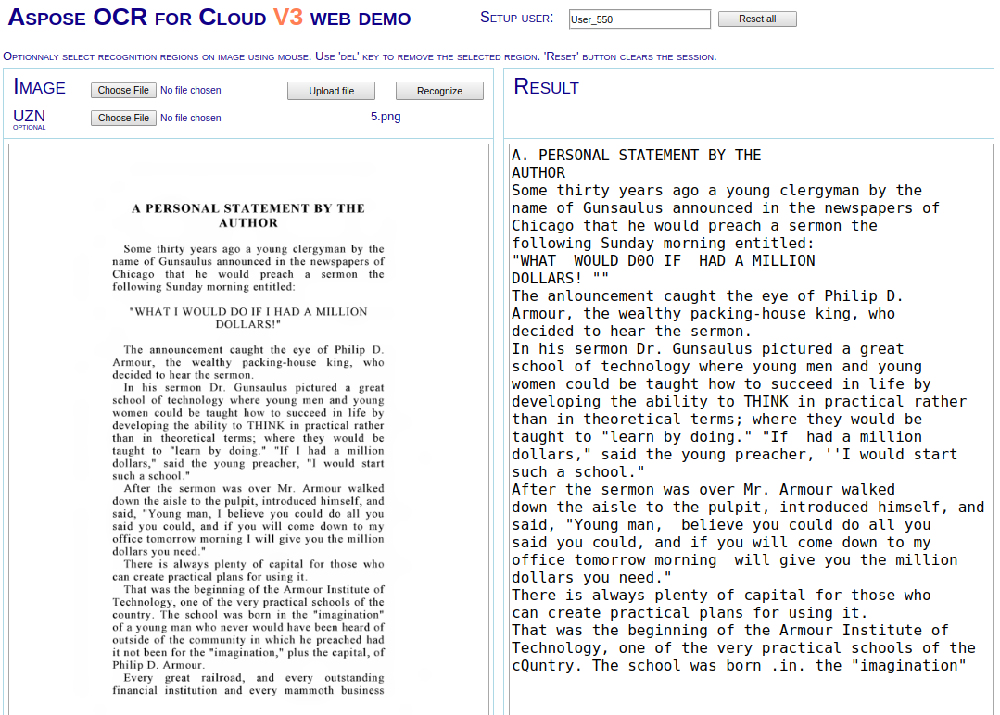

# Aspose.OCR Cloud

[Aspose.OCR Cloud](https://products.aspose.cloud/ocr/cloud) is a simple SDK used to add text recognition to your app with merely a few lines of code.

In detail, it's a set of SDKs for optical character recognition and document scanning in our Cloud. It supports reading and recognizing text from most commonly used raster image formats. Just pass a specific image to the Aspose.OCR Cloud API, and it will return a response with recognized text.

It is easy to get started with Aspose.OCR Cloud, and there is nothing to install. Create an account at Aspose Cloud and get your application information, then you are ready to use [SDKs](#asposeocr-cloud-sdks)

## Release 21.03:
We introduced an option to select or disable the Document Structure Recognition algorithm.


<a title="GOTO WEB DEMO" href="http://saltov-gpu-3.dynabic.com:8084/">
  
</a>

## Features:
- Automatic skew correction
- Automatic and manual document layout detection
- Advanced automated image pre-processing
- Extract and recognize text from images via OCR
- Supports multiple international languages
- High speed with no hardware resources

## How to use the SDK?

Our API is completely independent of your operating system, database system, or development language. You can use any language and platform that supports HTTP to interact with our API. However, manually writing client code can be difficult, error-prone, and time-consuming. Therefore, we have provided and support [SDKs](#asposeocr-cloud-sdks) in many development languages to make it easier to integrate with us.

## Example

```csharp
static string RecognizeFromUrl(Configuration conf)
{
    string imgUri = @"http://typecast.com/images/uploads/fluid-type-single-column.png";

    OcrApi api = new OcrApi(conf);
    var request = new PostOcrFromUrlOrContentRequest(null, imgUri);
    OCRResponse response = api.PostOcrFromUrlOrContent(request);

    return response.Text;
}

static string RecognizeFromContent(Configuration conf)
{
    string name = "10.png";
    using (FileStream fs = File.OpenRead(name))
    {
        OcrApi api = new OcrApi(conf);
        var request = new PostOcrFromUrlOrContentRequest(fs, language: LanguageGroup.German);
        OCRResponse response = api.PostOcrFromUrlOrContent(request);

        return response.Text;
    }
}
```
_________________________

## Quickstart

Make your solution using [SDK](#asposeocr-cloud-sdks), follow these steps:

#### 1. Get API keys if you haven't

Make a personal account on [Aspose Cloud Dashboard](https://dashboard.aspose.cloud/#/) and click _Get Keys_. These keys are useful for all Aspose Cloud products. If you have any trouble, look at this [detailed manual](https://docs.aspose.cloud/display/totalcloud/Create+New+App+and+Get+App+Key+and+SID).

#### 2. Run Demo
  * Checkout the SDK
  * Open [.NET 2.0](/Aspose.Ocr.Cloud.Sdk.Demo) or [.NET Core](/Aspose.Ocr.Cloud.Sdk.Demo.Net.Core) demo project
  * Set Your AppSid & AppKey
  * Run

<p align="center">
  <a title="Download ZIP" href="https://github.com/aspose-ocr-cloud/aspose-ocr-cloud-dotnet/archive/master.zip">
     
  </a>
</p>

_________________________

## Aspose.OCR Cloud SDKs

||||||||||
|--------------|----------|-------|-------|-------|---------|---------|----------|-------|
|[.NET & Core](https://github.com/aspose-ocr-cloud/aspose-ocr-cloud-dotnet)|[Java](https://github.com/aspose-ocr-cloud/aspose-ocr-cloud-java)|PHP|Ruby|Python|Node.js|[Android](https://github.com/aspose-ocr-cloud/aspose-ocr-cloud-android)|Objective-C|Perl|

## Resources

- **Website:** [https://www.aspose.cloud](https://www.aspose.cloud)
- **Product Home:** [Aspose.OCR Cloud](https://products.aspose.cloud/ocr/family)
- **Documentation:** [Aspose.OCR Cloud Documentation](https://docs.aspose.cloud/display/ocrcloud/Home)
- **Forum:** [Aspose.OCR Cloud Forum](https://forum.aspose.cloud/c/ocr)
- **Blog:** [Aspose.OCR Cloud Blog](https://blog.aspose.cloud/category/ocr/)
- **Pricing:** [Aspose Cloud Pricing](https://purchase.aspose.cloud/pricing)
- **Try out Aspose OCR online for free** [Aspose Image to Text](https://products.aspose.app/ocr/scan-image).
