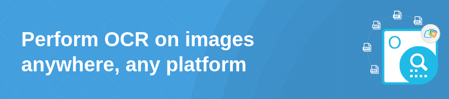

# Aspose.OCR Cloud
[](LICENSE)
[](https://www.nuget.org/packages/Aspose.OCR-Cloud/)

[Aspose.OCR Cloud](https://products.aspose.cloud/ocr/) is a simple OCR API to add text recognition to your app with just a few lines of code.

In detail, it's a set of SDKs for optical character recognition and document scanning in Cloud. It supports reading and recognizing text from the most commonly used raster image formats and PDF files. Just pass a specific image to the Aspose.OCR Cloud API, and get a response with recognized text.

It is easy to get started with Aspose.OCR Cloud and there is nothing to install. Create a free account at [Aspose Cloud Dashboard](https://dashboard.aspose.cloud/applications) and get your application information, then you are ready to use [SDKs](#asposeocr-cloud-sdks).

## Try Online
[Image to Text](https://products.aspose.app/ocr/scan-image) | [Image to Searchable PDF](https://products.aspose.app/ocr/ocr-to-pdf) | [PDF OCR](https://products.aspose.app/ocr/pdf-ocr)| [Receipt Scanner](https://products.aspose.app/ocr/scan-receipt)
:---: | :---: | :---:| :---:
[](https://products.aspose.app/ocr/scan-image) | [](https://products.aspose.app/ocr/ocr-to-pdf) | [](https://products.aspose.app/ocr/pdf-ocr) | [](https://products.aspose.app/ocr/scan-receipt) 


## Release 22.12.0

What was changed

This is the major release of Aspose.OCR Cloud which delivers significant new features, enhancements to existing features, performance improvements, and fixes. The list below contains the most important features that are supported in this release:

- Image to speech conversion
  Convert almost any picture or photo with readable characters into a natural human voice that can be played in the background or downloaded.
- Advanced image binarization 
  A specialized neural network for converting images to black and white for better text recognition.
- Automatic skew correction
  Detect image skew angle and automatically correct the tilt.
- Dewrapping 
  Detect perspective distortions and automatically straighten the image.
- Upscaling 
  Intelligently enhance image resolution without losing the content and quality.

Public API changes and backwards compatibility

BACKWARD INCOMPATIBILITY!

This release is based on a completely new architecture (version 5.0) that is not backward compatible with previous (version 3.0) principles and workflows. Version 3.0 is also available at Deprecated directory.

To maintain compatibility, please continue to use the previous version of the Aspose.OCR Cloud API.
Added public APIs:

See Aspose OCR Cloud 5.0 API Reference for the full list of new endpoints and request parameters.
Updated public APIs:

This is the first release based on the new (version 5.0) architecture. When updates, renames and improvements are introduced, they will be described in future Release Notes. Keep for updates.
Removed public APIs:

This is the first release based on the new (version 5.0) architecture. When some of the methods become deprecated, this will be announced in future Release Notes.


## Features
- Automated skew correction
- Automated and manual document layout detection
- Recognize documents with complex layouts in fully automatic mode or with manual corrections.
- Extract and recognize text from images via OCR
- Supports multiple international languages
- High speed with no hardware resources
- Receipt recognition
- Table image recognition
- Supports PDF Recognition
- Text correction using spell checking algorithms
- Various output formats: Text, Searchable PDF, hOCR, Excel for tables.
- Handwritten text recognition

## Recognize text of different languages
Aspose.OCR Cloud supports 45 languages including English, German, French, Italian, Spanish, Portuguese, Polish, Slovene, Slovak, Netherlands, Lithuanian, Latvian, Danish, Norwegian, Finnish, Serbian, Croatian, Czech, Swedish, Estonian, Romanian, Chinese, Arabic, Hindi, Russian, Ukrainian, Bengali, Tibetan, Thai, Urdu, Turkish, Korean, Indonesian, Hebrew, Javanese, Greek, Japanese, Persian, Albanian, Latin, Vietnamese, Uzbek, Georgian, Bulgarian, Azerbaijani  and a lot of other works too.

## How to use the SDK?

Our API is completely independent of your operating system, database system, or development language. You can use any language and platform that supports HTTP to interact with our API. However, manually writing client code can be difficult, error-prone, and time-consuming. Therefore, we have provided and support [SDKs](#asposeocr-cloud-sdks) in several development languages to make it easier to integrate with us.

## Example

```csharp
    string imageFileName = "samples/lorem_ipsum.png";

    RecognizeImageApi recognizeImageApi = new RecognizeImageApi(clientId, clientSecret);

    byte[] imageData = File.ReadAllBytes(imageFileName);

    var settings = new OCRSettingsRecognizeImage(
            language: Language.English,
            resultType: ResultType.Text,
            dsrMode: DsrMode.NoDsrNoFilter,
            makeContrastCorrection: false);

    var taskId = recognizeImageApi.PostRecognizeImage(new OCRRecognizeImageBody(
        image: imageData,
        settings: settings));

    var result = recognizeImageApi.GetRecognizeImage(taskId);

    result.Results.ForEach(res => Console.WriteLine(Encoding.UTF8.GetString(res.Data)));
```
_________________________

## Quickstart

Create simple solution using Aspose.OCR Cloud .NET SDK following these steps:

#### 1. Get API Credentials

Make a free personal account on [Aspose Cloud Dashboard](https://dashboard.aspose.cloud/#/) and navigate to [Applications](https://dashboard.aspose.cloud/applications) to get API Credentials - Client ID and Client Secret. These Credentials are used by all Aspose Cloud products. If you have any trouble, please check [step by step manual](https://docs.aspose.cloud/display/totalcloud/Create+New+App+and+Get+App+Key+and+SID).

#### 2. Run Demo
  * Checkout the SDK or install from [NuGet](https://www.nuget.org/packages/Aspose.OCR-Cloud/)
  * Open [.NET 6.0](/src/ExampleDotNet60v50) demo project
  * Set Your Client ID & Client Secret
  * Run

<p align="center">
  <a title="Download ZIP" href="https://github.com/aspose-ocr-cloud/aspose-ocr-cloud-dotnet/archive/master.zip">
     
  </a>
</p>

_________________________

## Aspose.OCR Cloud SDKs

||||||
|--------------|----------|-------|---------|---------|
|[.NET & Core](https://github.com/aspose-ocr-cloud/aspose-ocr-cloud-dotnet)|[Java](https://github.com/aspose-ocr-cloud/aspose-ocr-cloud-java)|[Python](https://github.com/aspose-ocr-cloud/aspose-ocr-cloud-python)|[Node.js](https://github.com/aspose-ocr-cloud/aspose-ocr-cloud-nodejs)|[Android](https://github.com/aspose-ocr-cloud/aspose-ocr-cloud-android)

## Resources
      
- **Website:** [https://www.aspose.cloud](https://www.aspose.cloud)
- **Product Home:** [Aspose.OCR Cloud](https://products.aspose.cloud/ocr/family)
- **Documentation:** [Aspose.OCR Cloud Documentation](https://docs.aspose.cloud/display/ocrcloud/Home)
- **Forum:** [Aspose.OCR Cloud Forum](https://forum.aspose.cloud/c/ocr)
- **Blog:** [Aspose.OCR Cloud Blog](https://blog.aspose.cloud/category/ocr/)
- **Pricing:** [Aspose Cloud Pricing](https://purchase.aspose.cloud/pricing)
- **Free Online Demo** [Aspose.OCR Image to Text](https://products.aspose.app/ocr/scan-image)